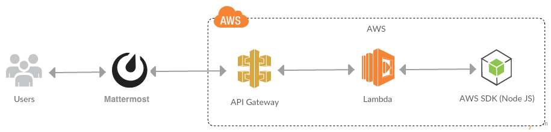

# aws-infra-automate-scripts
It is a bot which provides mechanism to manage (start, stop, check the status) of Ec2 machines with tags


## Usage
 `\infraautomatebot <command> (tagName=tagValue) (region)`

 The trigger word for this bot has been configured as "\\infraautomatebot" in Mattermost Custom Integration, so when you type ]\infraautomatebot in Mattermost the bot gets triggered.

## Mattermost Commands
1. For list of available commands
`\infraautomatebot help`

2. For usage details
`\infraautomatebot usage`

3. To execute a command (status/start/stop)
`\infraautomatebot <command> (tagName=tagValue) (region)`

# Architecture Diagram


# Installation and Setup

1. clone this project using `git clone https://github.com/endrapunaveen/aws-infra-automate-scripts`
2. change the dir using `cd aws-infra-automate-scripts`
3. Create your Lambda function that will process all Mattermost Requests and upload the above index.js
4. Create an API Gateway API
5. Create a method of type: POST
6. Select Integration Type: Lambda
7. Select the region in which you created your Lambda function
8. Select the Lambda Function you created
9. Click "Integration Request"
10. At the bottom of this Page select "Add mapping Template"
11. For content type please specify: "application/x-www-form-urlencoded"
12. Insert the template code below into the text field for the template. This code converts a URL Encoded form post into JSON for your Lambda function to parse
13. Deploy your API
14. In Mattermost, Go to Main Menu and Integrations
15. Click Slash Commands and Add Slash Command
16. Pick trigger word "infraautomatebot" for the Bot!
17. In Request URL, put the URL created by your API Gateway Deployment
18. Choose Request Method as POST
19. Click Save

#### Template code for Integration Request:
```
## convert HTML POST data or HTTP GET query string to JSON

## get the raw post data from the AWS built-in variable and give it a nicer name
#if ($context.httpMethod == "POST")
 #set($rawAPIData = $input.path('$'))
#elseif ($context.httpMethod == "GET")
 #set($rawAPIData = $input.params().querystring)
 #set($rawAPIData = $rawAPIData.toString())
 #set($rawAPIDataLength = $rawAPIData.length() - 1)
 #set($rawAPIData = $rawAPIData.substring(1, $rawAPIDataLength))
 #set($rawAPIData = $rawAPIData.replace(", ", "&"))
#else
 #set($rawAPIData = "")
#end

## first we get the number of "&" in the string, this tells us if there is more than one key value pair
#set($countAmpersands = $rawAPIData.length() - $rawAPIData.replace("&", "").length())

## if there are no "&" at all then we have only one key value pair.
## we append an ampersand to the string so that we can tokenise it the same way as multiple kv pairs.
## the "empty" kv pair to the right of the ampersand will be ignored anyway.
#if ($countAmpersands == 0)
 #set($rawPostData = $rawAPIData + "&")
#end

## now we tokenise using the ampersand(s)
#set($tokenisedAmpersand = $rawAPIData.split("&"))

## we set up a variable to hold the valid key value pairs
#set($tokenisedEquals = [])

## now we set up a loop to find the valid key value pairs, which must contain only one "="
#foreach( $kvPair in $tokenisedAmpersand )
 #set($countEquals = $kvPair.length() - $kvPair.replace("=", "").length())
 #if ($countEquals == 1)
  #set($kvTokenised = $kvPair.split("="))
  #if ($kvTokenised[0].length() > 0)
   ## we found a valid key value pair. add it to the list.
   #set($devNull = $tokenisedEquals.add($kvPair))
  #end
 #end
#end

## next we set up our loop inside the output structure "{" and "}"
{
#foreach( $kvPair in $tokenisedEquals )
  ## finally we output the JSON for this pair and append a comma if this isn't the last pair
  #set($kvTokenised = $kvPair.split("="))
 "$util.urlDecode($kvTokenised[0])" : #if($kvTokenised[1].length() > 0)"$util.urlDecode($kvTokenised[1])"#{else}""#end#if( $foreach.hasNext ),#end
#end
}
```
